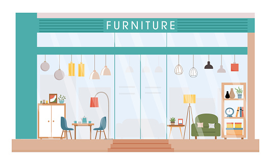
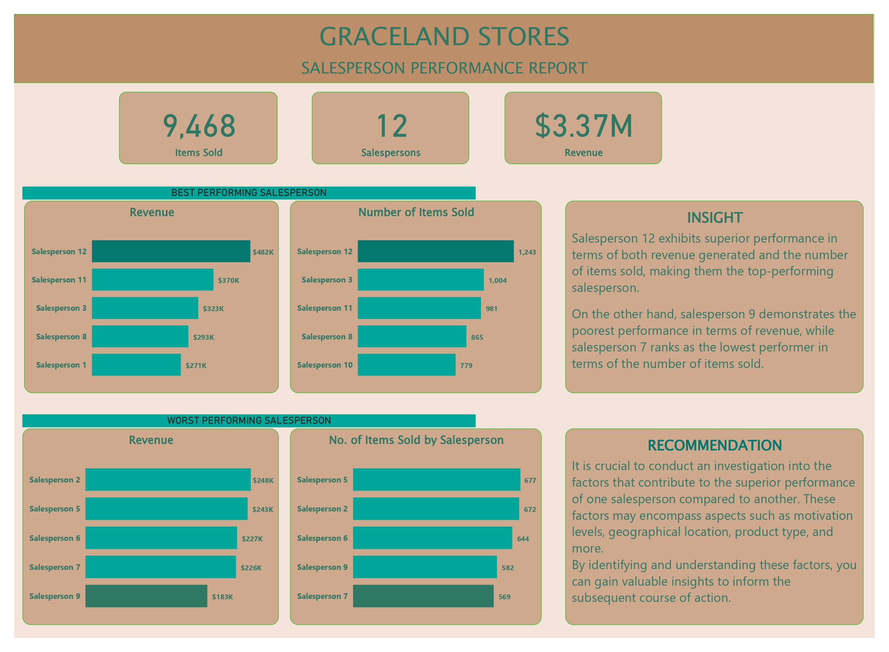

# GraceLand Stores

## Introduction
This was a class project done for an imaginary furniture store, Graceland Stores, to determine Salesperson and Product performance.

## Problem Statement
The company just made huge sales and want to reward the top performing salesperson, and also want to know the product that generates the highest revenue in order to make data driven decisions.

## Power BI tools used:
- Power query
- DAX
- New measures

## Analysis

### Data Loading and Cleaning
The dataset was loaded straight to power query from microsoft excel. It was a pretty neat dataset so not much cleaning was required, apart from the usual checking for duplicates and blank cells and data types.

### Data Modelling
There was no need for modelling as only one table was used for this analysis.

### DAX
A New Measures table was first created to house every new measure that will be calculated. 
1. Revenue: First, total price was gotten from Item Cost and Number of Items, then I proceeded to calculate revenue with the DAX formula: `Revenue = SUM('Grace Stores Data'[Total Cost])`.
2.  Total Items Sold: `Total Items Sold = SUM('Grace Stores Data'[No of Items])`.
3.  Number of salespersons: `No. of Salespersons = DISTINCTCOUNT('Grace Stores Data'[Salesperson])`.

### Visualization
The report consists of two pages;
1. Salesperson

This clearly shows that Salesperson 12 is the top performing salesperson, excelling both in revenue generation and product sales.
---
2. Product

Interestingly, while Showcase is the most sold product, it is Couch that generates the highest revenue. This can be attributed to Couch being the most expensive product in the inventory, which likely contributes significantly to its revenue dominance.

### Recommendations
- Salesperson 12 should be encouraged to share their sales techniques and strategies with other team members to elevate the overall sales team's performance.
- Develop targeted marketing campaigns to attract customers who prioritize quality. Also, expand the product portfolio with a focus on high-value items.
- Collect feedback from customers to understand their preferences, needs, and perceptions of products and pricing.

